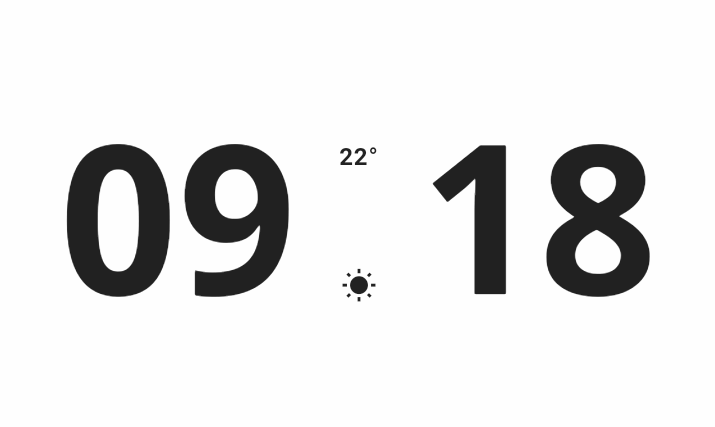

# Digital Flutter Clock
Digital flutter clock designed for Flutter Clock Contest (2020)

## Screenshots
<br/>  

   
<br/>  

   
<br/>  


## Initialization
Setup your project environment below by running the following steps :
   - Install [flutter](https://flutter.dev/docs/get-started/install)
   - Install [android studio](https://developer.android.com/studio/install)
   - Clone the repository on your machine :
      ```bash
         git clone https://github.com/Accelerator-One/flutter-digital-clock.git
         cd flutter-digital-clock
      ```
   - Follow the steps/commands below :
       - Initialize flutter dependencies.
       ```bash
    		flutter channel stable
    		flutter upgrade
       ```
		- Unzip the project : `flutter_clock.zip`
		```bash
         cd <name>_clock
         # name : clock mode
      ```
       - Run your project :
      ```bash
        flutter create .
        flutter run
        # android/ios : landscape 
      ```
